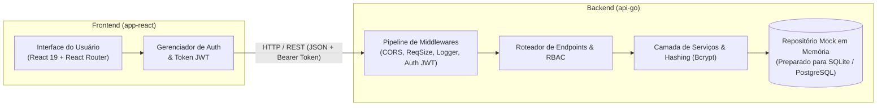

<div align="center">


# 🔐 PUC Web Auth App

Demo em: https://puc-web-auth-app.web.app/


**Aplicação Web Full-Stack para Gerenciamento de Usuários com Autenticação JWT e Controle RBAC**

[](https://go.dev/)
[](https://react.dev/)
[](https://vitejs.dev/)
[](https://getbootstrap.com/)
[](https://www.docker.com/)
[](https://jwt.io/)

</div>

---

## 📑 Sumário

- [Visão Geral](#-visão-geral)
- [Arquitetura](#-arquitetura)
- [Tecnologias Utilizadas](#-tecnologias-utilizadas)
- [Matriz de Rotas e Permissões (RBAC)](#-matriz-de-rotas-e-permissões-rbac)
- [Variáveis de Ambiente](#-variáveis-de-ambiente)
- [Pré-requisitos](#-pré-requisitos)
- [Instalação e Execução](#-instalação-e-execução)
  - [Executando com Go e Node (Local)](#1-executando-localmente)
  - [Executando com Docker](#2-executando-com-docker)
- [Como Testar](#-como-testar)
- [Segurança Implementada](#-segurança-implementada)
- [Documentação Completa](#-documentação-completa)
- [Autor e Licença](#-autor-e-licença)

---

## 🎯 Visão Geral

Este projeto foi desenvolvido como atividade prática da disciplina de **DevOps e Desenvolvimento Web** do curso de **Análise e Desenvolvimento de Sistemas da PUC-PR**.

O objetivo central é demonstrar a construção de uma aplicação web robusta, modular e segura contemplando:
- **API RESTful** desenvolvida em Go para gerenciamento completo (CRUD) de usuários;
- **Interface Frontend** em React 19 e Vite moderna e responsiva;
- **Autenticação segura** com login/senha gerando tokens **JWT (JSON Web Token)** assinados;
- **Autorização RBAC (Role-Based Access Control)** com restrição de métodos e rotas por perfil de usuário (`admin`, `usuario`, `cliente`);
- **Práticas de Defesa em Profundidade**: hashing com bcrypt, expiração de tokens, limitação de payload e controle de tentativas de login contra força bruta.

---

## 🏗️ Arquitetura

O sistema é dividido em dois módulos desacoplados:



* **`api-go/`**: Backend em Go ouvindo por padrão em `http://localhost:4000`.
* **`app-react/`**: Frontend SPA em React/Vite executando por padrão em `http://localhost:5173`.
* **Persistência atual**: Mock em memória (os dados reinicializam com o servidor, garantindo idempotência e facilidade de testes em ambiente acadêmico).

---

## 🛠️ Tecnologias Utilizadas

### Backend (Go)
* **Go `1.26+`** utilizando a biblioteca padrão `net/http` estruturada com middlewares idiomáticos;
* **Autenticação JWT:** [`golang-jwt/jwt/v5`](https://github.com/golang-jwt/jwt);
* **Criptografia e Hashing:** [`golang.org/x/crypto/bcrypt`](https://pkg.go.dev/golang.org/x/crypto/bcrypt);
* **Identificadores Únicos:** [`google/uuid`](https://github.com/google/uuid);
* **Configuração:** [`joho/godotenv`](https://github.com/joho/godotenv).

### Frontend (React)
* **React `19`** e **Vite `8`**;
* **Navegação e Rotas:** `react-router-dom`;
* **Estilização e Componentes:** `react-bootstrap` e `bootstrap-icons`;
* **Qualidade de Código:** `ESLint`.

### Testes e Infraestrutura
* **Docker** e Dockerfile multi-stage / containerizado;
* **Bruno API Client** (coleções organizadas em `test-api/`);
* **Scripts Bash** para automação (`executar.sh`).

---

## 🛡️ Matriz de Rotas e Permissões (RBAC)

A API protege os recursos validando o perfil contido nas *claims* do JWT:

| Método | Rota / Endpoint | Finalidade | Perfis Autorizados | Resposta Padrão |
| :---: | :--- | :--- | :---: | :---: |
| `POST` | `/login` | Autenticação e emissão de JWT | *Público* | `200 OK` (com Token) |
| `GET` | `/login` | Dados do usuário autenticado no token | `admin`, `usuario`, `cliente` | `200 OK` |
| `GET` | `/usuarios` | Listagem geral de usuários | `admin`, `usuario` | `200 OK` |
| `GET` | `/usuarios/{uid}` | Detalhes de um usuário específico | `admin`, `usuario` | `200 OK` |
| `POST` | `/usuarios` | Cadastro de novo usuário | `admin` | `201 Created` |
| `PUT` | `/usuarios/{uid}` | Edição de usuário existente | `admin` | `200 OK` |
| `DELETE` | `/usuarios/{uid}` | Remoção de usuário | `admin` | `200 OK` |
| `GET / POST` | `/` e `/sobre` | Informações institucionais / autor | *Público* | `200 OK` |

> ⚠️ Caso a requisição não envie o token ou o mesmo esteja expirado, retorna-se `401 Unauthorized`. Se o perfil do usuário não tiver permissão para a rota/método, a API responde `403 Forbidden`.

---

## ⚙️ Variáveis de Ambiente

O backend aceita configurações via arquivo `.env` no diretório `api-go/` ou via variáveis do sistema operacional:

| Variável | Valor Padrão | Descrição |
| :--- | :---: | :--- |
| `AMBIENTE` | `dev` | Define o ambiente (`dev` ou `prod`). Em produção, exige chave segura obrigatória. |
| `PORTA` | `:4000` | Porta TCP onde a API Go escuta as requisições HTTP. |
| `JWTSECRET` | `minha-senha-secreta` | Segredo utilizado para assinar e validar os tokens JWT. |

---

## 📋 Pré-requisitos

Certifique-se de possuir instalado em sua máquina:
* [Go](https://go.dev/dl/) (versão compatível com o módulo);
* [Node.js](https://nodejs.org/) (versão LTS recomendada) e [npm](https://www.npmjs.com/);
* [Docker](https://www.docker.com/) (opcional, para execução em containers);
* [Bruno](https://www.usebruno.com/) (opcional, para execução das coleções de teste HTTP).

Para verificar:
```bash
go version
node --version
npm --version
docker --version
```

---

## 🚀 Instalação e Execução

### 1. Executando Localmente

#### Passo 1: Inicializar a API Go
```bash
cd api-go
go mod download
go run .
```
> O backend estará pronto em: **`http://localhost:4000`**

#### Passo 2: Inicializar o Frontend React (em outro terminal)
```bash
cd app-react
npm install
npm run dev
```
> O frontend estará disponível em: **`http://localhost:5173`**

---

### 2. Executando com Docker

Você pode subir a API Go diretamente via container Docker:

```bash
cd api-go
docker build -t puc-react-api:dev .
docker run --rm -p 4000:4000 puc-react-api:dev
```

*Alternativamente, utilize o script automatizado:*
```bash
chmod +x executar.sh
./executar.sh
```

---

## 🧪 Como Testar

### Testes Automatizados e Sintaxe
```bash
# Validar compilação e tipagem do Backend Go
cd api-go
go test ./...
go vet ./...

# Validar lint e build do Frontend React
cd ../app-react
npm run lint
npm run build
```

### Testes Manuais de Rotas (Bruno e cURL)
* As coleções prontas com testes de login, criação, listagem e remoção estão disponíveis no diretório [`test-api/`](test-api/).
* Para checagem rápida da integridade da API via terminal:
```bash
curl http://localhost:4000
```

---

## 🔒 Segurança Implementada

1. **Hashing com Salt (Bcrypt):** Nenhuma senha é salva em texto simples.
2. **Tokens JWT Estruturados:** Contêm `uid`, `login`, `perfil`, `iat` e `exp` (expiração de 1 hora).
3. **Controle de Tentativas (Anti-Brute Force):** Atraso progressivo, bloqueio temporário e rastreio de falhas por IP e por conta.
4. **Respostas Opacas:** Falhas de autenticação utilizam respostas genéricas para evitar enumeração de contas existentes.
5. **Proteção de Payloads:** Middleware de limite de tamanho de requisição para mitigar ataques de negação de serviço (DoS).

---

## 📚 Documentação Completa

O detalhamento conceitual e técnico de cada camada está disponível na pasta [`documentacao/`](documentacao/):

| Documento | Assunto |
| :--- | :--- |
| 📄 [0 - Visão Geral](documentacao/0-visao-geral.md) | Escopo, regras de negócio e critérios acadêmicos da atividade |
| 📄 [1 - Modelo da API](documentacao/1-modelo-api.md) | Especificação de rotas, contratos e códigos de retorno HTTP |
| 📄 [2 - Segurança com JWT](documentacao/2-seguranca-jwt.md) | Ciclo de vida do token, claims, validação e assinaturas |
| 📄 [3 - Controle RBAC](documentacao/3-controle-rbac.MD) | Definição dos perfis de usuário e mapeamento de acessos |
| 📄 [4 - OAuth 2.0](documentacao/4-OAuth2.md) | Proposta e estudo conceitual para integração com parceiros |
| 📄 [5 - Análise de Segurança](documentacao/5-analise-seguranca.md) | Matriz de riscos identificados e mitigações aplicadas |

---

## 👨‍💻 Autor e Licença

**Handerson Gleber de Lima Cavalcanti (Gravatinha)**  
*Estudante de Análise e Desenvolvimento de Sistemas — PUC-PR*  

📧 **E-mail:** [handerson.gleber@gmail.com](mailto:handerson.gleber@gmail.com)  
📸 **Instagram:** [@handersongleber](https://www.instagram.com/handersongleber/)  

---
Este projeto é disponibilizado sob **licença livre** para fins de estudo e avaliação acadêmica.
